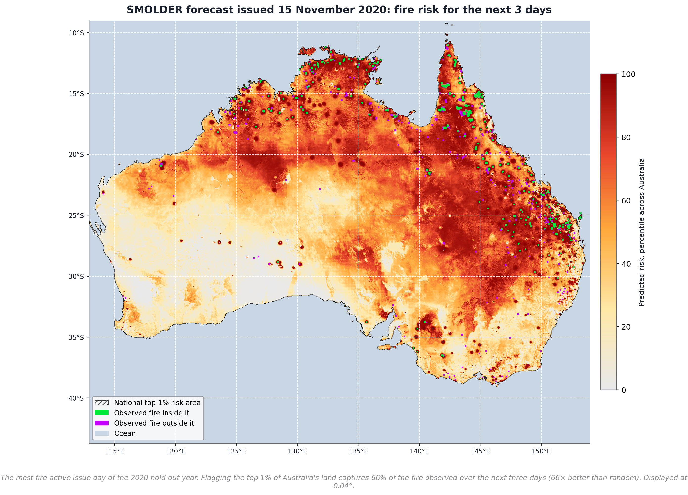
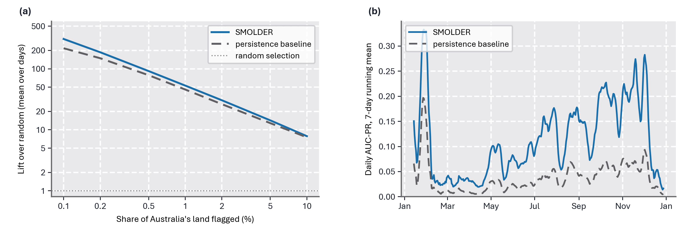
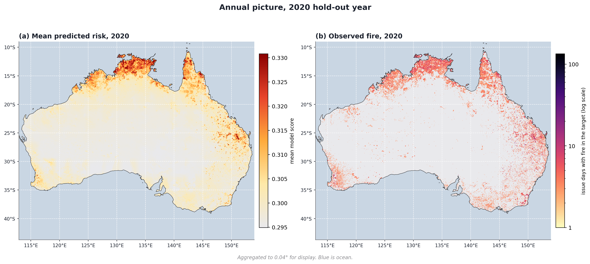
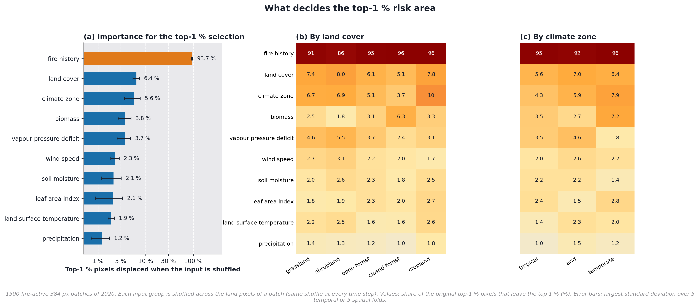
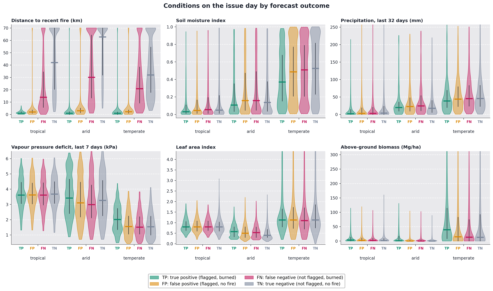
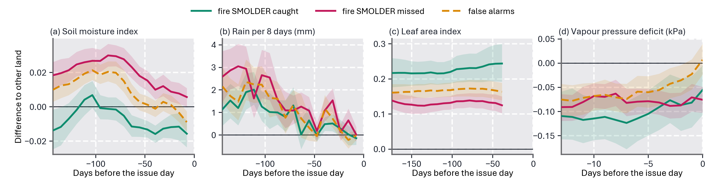

# SMOLDER

**S**low-**M**emory **O**perator with **L**atent **D**ual-attention for
**E**stimating fire **R**isk: a per-pixel forecast of wildfire occurrence over
the next three days for continental Australia at 0.01° (~1 km) resolution.

Fire needs fuel that is dry enough and weather that lets it ignite and spread.
The two change on different time scales: fuel state over months, fire weather
over days. SMOLDER therefore reads two input streams, 144 days of vegetation,
soil moisture and rainfall and 14 days of fire weather and recent fire. Each
stream has its own ConvLSTM encoder, and the two are fused by per-pixel
cross-attention.


## Task

For an issue day *D* and every land pixel, SMOLDER outputs a risk score for
**at least one VIIRS active-fire detection on day D+1, D+2 or D+3**. Inputs
contain no information later than *D*. The output is a ranking score, not a
calibrated probability (see *Limitations*).

- Grid: 3474 × 4110 px, EPSG:4326, 0.01° pixels, origin 112.905° E / 9.005° S
- Split by year: train 2015 to 2018, validation 2019 (checkpoint selection),
  test 2020 (used only for the numbers below)

## Inputs


All fields are resampled to the SMIPS grid. Gaps in the 8-day LAI are filled
by carrying the last observation forward. The original cubes also hold NDVI
(MODIS MOD09A1), which the model does not read.

## Training

| Setting | Value |
|---|---|
| Encoders | ConvLSTM, 1 layer, 64 hidden channels, 5 × 5 kernels |
| Fusion | multi-head cross-attention (4 heads); the fast state queries the slow state per pixel |
| Parameters | 1.09 M |
| Patches | 384 × 384 px, 2000 per epoch; half of the draws must contain ≥ 45 fire pixels |
| Batch | 2, gradient accumulation 4 |
| Optimiser | AdamW, lr 3 × 10⁻⁴, weight decay 0.01, cosine schedule with a 25-epoch period, up to 40 epochs, early stopping on validation AP (patience 6) |
| Loss | BCE on soft labels (fire 0.9, background 0.02), plus 0.3 × Dice for epochs 0 to 2; positive weight annealed 100 → 20 over 8 epochs; isolated fire pixels up-weighted (γ = 2); auxiliary loss on every fast time step (weight 0.3) |
| Sampling | 30 % of patches must contain fire absent from the fire history; fire-history channels zeroed for 30 % of samples |
| Released weights | average of the three best checkpoints by validation AP (epochs 13, 14, 18) |

The exact configuration is in [configs/smolder.env](configs/smolder.env).


## National evaluation, 2020 hold-out year

The model is run over the whole continent for every valid issue day of 2020
(350 days, 6.9 M land pixels per day), as overlapping
384 px tiles blended towards tile centres. Every land pixel is scored against
every other, as in an operational national product.



| Metric | Value |
|---|---|
| AUC-PR, pooled over all days and land pixels | **0.089** (base rate 0.032 %) |
| ROC-AUC | 0.916 |
| AUC-PR on 25 km cells (does a cell see fire) | 0.372 (base rate 3.4 %) |
| Calibration error after isotonic fit on 2019 | 0.00012 |

| Share of Australia flagged | Fire caught | Lift, all fire | New fire caught | Lift, new fire |
|---|---|---|---|---|
| 0.1 % | 28 % | 276× | 2 % | 22× |
| 0.5 % | 43 % | 86× | 15 % | 30× |
| 1 % | 50 % | 50× | 25 % | 25× |
| 5 % | 68 % | 14× | 52 % | 10× |
| 10 % | 74 % | 7× | 61 % | 6× |

Values are means over days. Skill varies with season (AUC-PR DJF 0.139, JJA 0.078, MAM 0.034, SON 0.129) and
climate (AUC-PR arid 0.056, temperate 0.093, tropical 0.102); it is lowest in autumn (MAM) and in the arid interior.





Reproduce with `CALIB_YEAR=2019 python -m smolder.evaluation.evaluate_national`
(about 3 hours on one A100).

## Patch evaluation, 2020 hold-out year

Skill inside fire-active 384 px windows, a complementary view that isolates
how well fire pixels are ranked where fire occurs.

| Metric | Value |
|---|---|
| AUC-PR (average precision) | **0.090** |
| ROC-AUC | 0.851 |
| Base rate (fire pixels among evaluated land pixels) | 0.16 % |
| Mean share of fire captured in the top 0.5 % of each patch | 29 % |
| Lift at top 0.5 %, all fire | 58.5× |
| Lift at top 0.5 %, new fire | 13.6× |


| Top-k | TPR, all fire | Lift, all fire | TPR, new fire | Lift, new fire |
|---|---|---|---|---|
| 0.01 % | 0.027 | 271.9× | 0.000 | 1.5× |
| 0.1 % | 0.140 | 139.7× | 0.006 | 6.1× |
| 0.2 % | 0.201 | 100.6× | 0.022 | 11.1× |
| 0.5 % | 0.292 | 58.5× | 0.068 | 13.6× |
| 1 % | 0.361 | 36.1× | 0.123 | 12.3× |
| 2 % | 0.426 | 21.3× | 0.193 | 9.7× |
| 5 % | 0.508 | 10.2× | 0.305 | 6.1× |
| 10 % | 0.572 | 5.7× | 0.403 | 4.0× |

**Evaluation protocol.** 1500 patches of 384 × 384 px are drawn with a
fixed seed from fire-active scenes (≥ 45 fire pixels and ≥ 50 % land per
patch). The results therefore measure how well SMOLDER ranks pixels *where
fire occurs*, not the continent-wide false-alarm rate. AUC-PR and ROC-AUC are
pooled over all 189.2 M land pixels of all patches. TPR and lift are computed per patch
(top-k of that patch's land pixels) and averaged. *New fire* is target fire
more than 3 px (taxicab distance) from any fire in the newest fire-history
window, i.e. fire detected on days D−2 to D. Reproduce with
`python -m smolder.evaluation.evaluate`.

## Observed fire and predicted risk

Four 2020 forecasts. Left: fire detected in the three days after the issue
date. Right: SMOLDER's risk map issued on that date, as a within-patch
percentile, with the top-1 % area outlined.


## What "new-fire lift" measures

Whether a fire pixel counts as "new" depends on how far it must be from
earlier fire and how far back "earlier" reaches; the lift depends on both.


With the headline definition (no fire within 3 px in the last 3 days)
61 % of fire pixels count as new and the lift is 11.6×. Requiring no fire
within 10 px in the last 3 days leaves 41 % of fire pixels at a lift of
2.2×. Requiring no fire within 10 px in the last 32 days leaves 19 % of
fire pixels, and the lift falls to 0.14×, below random: fire far from
anything that burned in the past month is not anticipated.

## What decides the top-1 % risk area

To see why the model flags the pixels it does, each input group was shuffled
across the land pixels of a patch (keeping every pixel's time series intact
but breaking its link to location), and the share of the original top-1 %
pixels that then left the top 1 % was measured. 1500 fire-active
patches of 2020, split into 5 consecutive time blocks and 5 west-to-east
regions to check that the results hold across season and space.



- **Fire history decides the selection.** Shuffling it displaces
  94 % of the top-1 % pixels (91 to 97 % across time
  blocks, 91 to 98 % across regions) and removes 95 % of
  AUC-PR. Every other input displaces at most 6 %.
- **Among the rest, land cover and climate zone matter most**, followed by
  biomass and vapour pressure deficit. Vapour pressure deficit matters most
  in shrubland, grassland and the arid zone; biomass in closed forest and the
  temperate zone. Precipitation, soil moisture, leaf area index and land
  surface temperature each shift 1 to 2 % of the selection.



- **Flagged pixels sit next to recent fire.** Correctly flagged pixels that
  burned lie a median of about 1 km from fire detected in the three days
  before; false alarms about 2 to 3 km; missed fires 14 to 30 km.
- **Within that, the fires that happen are drier.** In the temperate zone,
  correctly flagged pixels had lower soil moisture (median 0.37 against about
  0.5), higher vapour pressure deficit (2.0 against 1.5 kPa) and more biomass
  than false alarms or other pixels; in the arid zone, lower soil moisture.



- **What precedes fire, independently of the model:** pixels that burned in
  closed forest dried out steadily over the 144 days before, ending well
  below comparable pixels that did not burn, and vapour pressure deficit rose
  over the last two weeks in forest and shrubland. Burned grassland and
  shrubland carried more leaf area (fuel) than unburned ones throughout.
  These signals are real but small next to the effect of fire already
  burning nearby, which is why the model relies on fire history.

Reproduce with `python -m smolder.evaluation.explain_topk`, then
`cd figures && python make_explain_figures.py --summarize explain_2020_pixels.csv.gz && python make_explain_figures.py`.

## Why not train without fire history?

If fire history decides the top 1 %, removing it might seem a way to force
the model to predict genuinely new fires. This was tested and is not used:

- **A model without any fire-history input** (trained on the same data and
  recipe) lost almost all overall skill: validation AP 0.012 against 0.51 for
  the model with fire history at the time. Being blind to fire, it was not
  affected by the fire-history correction described below.
- **Far from recent fire it was not better than the released model.** For
  fire more than 10 km from any fire in the three history windows before the
  issue day, it reached a lift of 0.6×; the released model reaches 1.0× on
  the same definition, and 2.2× when only the last three days of fire are
  considered.
- **Combining the two did not help either.** Using the fire-history-free
  model only where no fire had burned nearby, and the main model elsewhere,
  never beat the main model alone at any mixing ratio.

The reason is visible in the analysis above: the new fire that the model
predicts well is mostly the spread front 1 to 5 km from existing fire, which
needs fire history, while weather and fuel inputs each shift only 1 to 6 % of
the ranking and carry little information about where an isolated ignition
will occur. More promising routes for isolated fires are inputs that describe
ignition rather than flammability, such as daily lightning strikes, or a
coarser target such as fire anywhere in a 10 to 25 km cell, where the model
already reaches a cell AUC-PR of 0.37.

## Limitations

- **Skill depends on fire that is already burning.** Skill is concentrated
  near recent fire: spread, flare-ups and re-detection. Ignitions more than
  10 km from any fire of the past month are ranked below random
  (0.14× lift; see the figure above). The immediate cause of
  an isolated ignition (a lightning strike, a spark) is a point event with no
  precursor in any 1 km daily field, so part of this limit is probably
  irreducible at this resolution.
- **Additional 1 km predictors did not help.** During development, lightning
  climatology, terrain (elevation, slope, aspect), fuel age, downwind
  alignment, road distance, population, a McArthur forest fire danger index
  from SILO reanalysis, and Sentinel-2 live fuel moisture aggregated to 1 km
  were each tested. None improved hold-out skill beyond evaluation noise, so
  none is used. After the fire-history correction described below, two
  groups were re-tested in full training runs: lightning, terrain, fuel age
  and downwind alignment raised patch AUC-PR from 0.090 to 0.095 but left
  new-fire lift unchanged (13.3× vs 13.6×) and lowered it far from recent
  fire; the fire danger index with fuel moisture gave no gain at all. Likely
  reasons for a genuine plateau: sub-kilometre fuel continuity and ignition
  sources are averaged away at 1 km, and the weather inputs, at 4.4 km
  (wind) to about 31 km (vapour pressure deficit) resolution, vary little
  between neighbouring pixels.
- **Labels are satellite detections.** VIIRS misses fires under cloud or
  canopy, small or short-lived fires, and fires between overpasses. Missed
  detections enter as negatives, both as targets and in the fire history.
- **One test year.** 2020 includes the end of the 2019/20 Black Summer fire
  season. Performance in other years has not been measured.
- **Scores are not probabilities.** The positive-class weighting compresses
  the raw output. `smolder.evaluation.fit_recalibration` fits an isotonic map
  on the 2019 validation year. This changes the probability values but not
  the ranking.

## Correction to earlier versions

Versions of this repository before v1.0 reported a 2020 AUC-PR of 0.4485 and
a new-fire lift of 14.5×. These results are withdrawn. In that model the
most recent fire-history input covered detections up to and including the
first day of the target window, a one-day overlap between input and label:
30 % of target fire pixels were visible in the input only through this
overlap. The released model is retrained with fire history that ends on the
issue day for every time step. All results above are from the corrected
model; its all-fire lift at the top 0.5 % is 58.5× instead of 103×, while
the new-fire lift is almost unchanged (13.6× instead of 14.5×).

## Data

| Zenodo DOI | Content | Size |
|---|---|---|
| [10.5281/zenodo.22115979](https://doi.org/10.5281/zenodo.22115979) | `cube_2020_zenodo.tar` → `cube_2020_zenodo.zarr`: daily cube for the 2020 test year | 35 GB |
| [10.5281/zenodo.21749290](https://doi.org/10.5281/zenodo.21749290) | `cube_slow_8day.tar` → `cube_slow_8day.zarr`: LAI, soil moisture and precipitation in 8-day bins, 2015 to 2020; `aux_rasters.tar`: static rasters not used by the released model | 16 GB + 2.8 GB |

Download both records and extract the archives into one directory, for
example `tar -xf cube_2020_zenodo.tar && tar -xf cube_slow_8day.tar`; set
`SMOLDER_DATA` to that directory. The two records are sufficient to reproduce
every result in this README. The
2015 to 2019 daily cubes (~250 GB) are not archived because they exceed the
record size limit.

**Daily cube** (`zarr` v2, one store per year):

| Array | Shape | Content |
|---|---|---|
| `X` | (days, 3474, 4110, 6) | channels listed in the attribute `channels`: soil moisture, wind, VPD, precipitation, LST, LAI (native units; missing = 0) |
| `y_fire_3d` | (days, 3474, 4110) | 1 if VIIRS detected fire at the pixel on day t+1, t+2 or t+3 |
| `y_fire_3d_valid` | (days,) | per-day validity flag of `y_fire_3d` |
| `landmask` | (3474, 4110) | 1 = land |
| `agb`, `landcover`, `koppen_geiger` | (3474, 4110) | static layers read by the model |
| `elevation`, `slope`, `aspect_sin`, `aspect_cos`, `lightning` | (3474, 4110) | static layers not read by the released model |
| other `y_fire_*` | | alternative targets, not used |

Attribute `time` lists the ISO date of each day. **`y_fire_3d` is 1 over the
ocean**; apply `landmask` before any metric or distance computation.

## Installation and use

```bash
git clone https://github.com/kmueller00/smolder-wildfire-australia
cd smolder-wildfire-australia
pip install -e .

export SMOLDER_DATA=/path/to/zarr/stores   # holds cube_2020_zenodo.zarr and cube_slow_8day.zarr

python -m smolder.evaluation.evaluate_national          # national evaluation (GPU, about 3 h)
python -m smolder.evaluation.evaluate                   # patch evaluation (GPU recommended)
python -m smolder.evaluation.newfire_definition_sweep   # distance dependence of new-fire lift

# training (needs the 2015-2019 cubes)
set -a; source configs/smolder.env; set +a
python -m smolder.training.train
```

Figures are regenerated from `results/` without data or GPU:
`cd figures && python make_<name>.py`.

```
smolder/
  data/         data pipeline, slow-cube builder, channel statistics
  models/       ConvLSTM backbone and Lightning modules
  training/     training entry point
  evaluation/   evaluation, distance sweep, checkpoint averaging, recalibration
configs/        training configuration of the released model
checkpoints/    released weights (smolder_swa.ckpt)
results/        evaluation outputs behind every figure and table
figures/        figures and the scripts that draw them
```

## References

- Beck, H. E. et al. (2023). High-resolution (1 km) Köppen-Geiger maps for 1901-2099 based on constrained CMIP6 projections. *Scientific Data* 10, 724.
- Buchhorn, M. et al. (2020). Copernicus Global Land Service: Land Cover 100 m, collection 3.
- Hersbach, H. et al. (2020). The ERA5 global reanalysis. *Quarterly Journal of the Royal Meteorological Society* 146, 1999-2049.
- Montes, C., Schulthess, U., Lashkari, A. (2021). An ERA5-based global dataset of vapor pressure deficit at maximum air temperature over land. CIMMYT Research Data & Software Repository Network, V1. https://hdl.handle.net/11529/10548556
- Schroeder, W. et al. (2014). The New VIIRS 375 m active fire detection data product. *Remote Sensing of Environment* 143, 85-96.
- Su, C.-H. et al. (2024). BARRA-C2: Development of the kilometre-scale downscaled atmospheric reanalysis over Australia. Bureau Research Report 097, Bureau of Meteorology, Australia.
- Yan, K., Wang, J., Peng, R., Yang, K., Chen, X., Yin, G., Dong, J., Weiss, M., Pu, J., Myneni, R. B. (2024). HiQ-LAI: a high-quality reprocessed MODIS leaf area index dataset with better spatiotemporal consistency from 2000 to 2022. *Earth System Science Data* 16, 1601-1622. https://doi.org/10.5194/essd-16-1601-2024
- Zhang, T., Zhou, Y., Zhu, Z., Li, X., Asrar, G. R. (2022). A global seamless 1 km resolution daily land surface temperature dataset (2003-2020). *Earth System Science Data* 14, 651-664.

Each input dataset remains under its provider's licence.

## Citation

Please cite the software (metadata in [CITATION.cff](CITATION.cff)) and the
data records above.

```bibtex
@software{mueller_smolder_2026,
  author  = {Müller, Korbinian},
  title   = {SMOLDER: next-3-day wildfire risk for continental Australia at 1 km},
  year    = {2026},
  version = {1.0},
  url     = {https://github.com/kmueller00/smolder-wildfire-australia}
}
```

## License

MIT for the code (see LICENSE).
