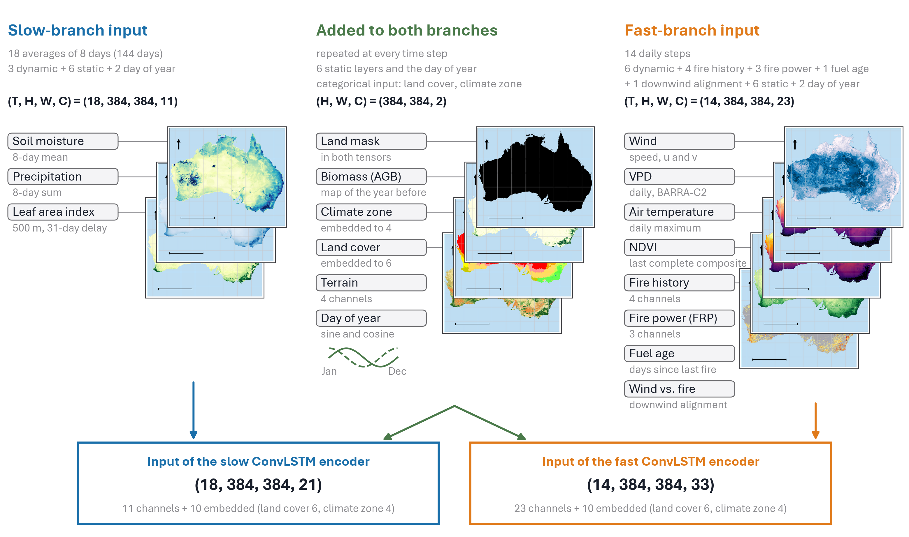

# SMOLDER

**S**low-**M**emory **O**perator with **L**inked **D**ual branches for
**E**stimating fire **R**isk: a daily forecast of where wildfire will be
detected in the next three days, for every 1 km pixel of continental
Australia.


## In short

Every day, SMOLDER reads what is known about each 1 km pixel of Australia up
to that day (the weather of the last two weeks, the state of vegetation and
soil over the last five months, and where fire has burned recently) and gives
each pixel a score for how likely a satellite will detect fire there in the
next three days. Pixels whose score is above a fixed threshold are flagged.

How good is that? The natural yardstick is **persistence**, the rule a fire
manager would use without any model: "fire is likely next to fire that is
already burning". On the validation year 2019, SMOLDER

- flags less land than persistence (0.111 % against 0.191 % of Australia per
  day on average) and still catches more of the fire that follows (39.8 %
  against 33.3 %), with about twice the precision (0.1946 against 0.0945);
- ranks pixels better than persistence on every single day of the year
  (daily AUC-PR higher on 100 % of 349 days);
- reaches an AUC-PR of 0.2091, 3.4 times that of persistence (0.0609), where
  a random ranking would score the base rate of 0.0543 %.

What it cannot do: predict a fire that starts far from any fire already
burning. Of the fire it catches, 91.2 % lies within 3 km of fire detected in
the last three days, and fire more than 10 km away is almost never caught
(0.6 %). A lightning strike or a spark leaves no trace in 1 km daily weather
and vegetation data, and none of the inputs we tested changed that.

Every input contains only information that was available on the day the
forecast is issued. This was checked input by input (see
[Keeping later information out of the inputs](#keeping-later-information-out-of-the-inputs)),
because satellite products are often smoothed or gap-filled with later data,
which would make a forecast look better than it can be in practice.

> **Test year 2020.** The numbers above are from 2019, the year used to choose
> the model and its threshold. The single evaluation of the final model on the
> test year 2020 is added below once it has finished.

| | SMOLDER | persistence | source |
|---|---|---|---|
| pooled AUC-PR, 2019 (349 issue days) | 0.2091 | 0.0609 | `national_2019.json`, `national_2019_persistence.json`: pooled_auc_pr |
| pooled ROC-AUC, 2019 | 0.9299 | 0.9355 | same files: pooled_roc_auc |
| days with the higher daily AUC-PR | 100 % | | `comparison_2019.json` |
| fire caught at the best-F2 threshold of 2019 | 39.8 % | 33.3 % | `adaptive_budget_2019.json`: adaptive_best.*.f2.recall |
| mean share of land flagged per day | 0.111 % | 0.191 % | same: mean_share |
| precision | 0.1946 | 0.0945 | same: precision |
| F2 | 0.3294 | 0.2214 | same: f2 |
| test year 2020 | *after the evaluation* | | `results/experiments/smolder/causal_b_50ep_seed123/test_2020/` |

Files of the final model are in `results/experiments/final/causal_b_50ep_seed123/`
(2019) and `results/experiments/final/persistence_2019/`.

## Terms used below

- **Issue day D.** The day a forecast is made. The target is fire on days D+1
  to D+3.
- **Base rate.** The share of land pixels that burn in a three-day window:
  0.0543 % in 2019, about one pixel in 1800. Any skill has to be judged
  against this rarity.
- **Persistence.** Ranks every pixel by its distance to the nearest fire
  detected on days D-2 to D. It is hard to beat because fire spreads and is
  re-detected.
- **AUC-PR (average precision).** Summarises how well burning pixels are
  ranked above non-burning ones over all thresholds; a random ranking scores
  the base rate, a perfect one 1. "Pooled" means all days and all land pixels
  of the year are ranked together, as in a national product.
- **Threshold, flagged area.** A pixel is flagged when its score is above one
  threshold, the same on every day. The threshold is chosen on 2019 and used
  unchanged on 2020, so the test year cannot influence it. The flagged area
  therefore changes from day to day with the fire situation.
- **Fire caught (recall), precision, F1, F2.** Fire caught is the share of
  burning pixels that were flagged; precision the share of flagged pixels
  that burned. F1 weighs both equally, F2 counts a missed fire twice as much
  as a false alarm, which suits a warning product. We report both operating
  points; F2 is the main one.
- **Distance bands.** Fire within 3 km, 3 to 10 km and more than 10 km of the
  nearest fire detected on days D-2 to D, to separate fire spreading from
  existing fires from new ignitions.

## How SMOLDER works

Fire needs fuel that is dry enough and weather that lets it ignite and
spread. The two change on different time scales: the fuel over months, the
fire weather over days. SMOLDER therefore has two branches.



- **Slow branch:** 18 averages of 8 days (144 days) of leaf area index, soil
  moisture and precipitation, plus the static layers. Input tensor
  (18, 384, 384, 11).
- **Fast branch:** 14 daily steps of wind (speed and direction), vapour
  pressure deficit, maximum air temperature, NDVI, fire history and distance
  to recent fire, fire radiative power, fuel age (days since the pixel last
  burned) and the alignment of the wind with the direction to the nearest
  fire, plus the static layers. Input tensor (14, 384, 384, 23).
- **Both:** biomass, land mask, elevation, slope, aspect, day of year, and
  land cover and climate zone as learned embeddings (10 channels).

Each branch is a ConvLSTM (one layer, 64 hidden channels, 5 x 5 kernels) that
runs over its time steps. At every fast step, a learned projection of the
slow state is added to the fast state and normalised. With one slow state per
pixel this is what cross-attention reduces to, so the model is formally a
cross-attention fusion with a single key. The fused state and the slow state
(128 channels) go through a 5 x 5 convolution to the score. 1.19 M parameters
(1,187,842).

**Inputs and their timing** (all on the 0.01 degree SMIPS grid, 3474 x 4110 px,
EPSG:4326, origin 112.905 E / 9.005 S):

| input | source | native resolution | as the model reads it on issue day D |
|---|---|---|---|
| fire history (3 maps), distance to recent fire | VIIRS S-NPP 375 m active fire (NASA FIRMS), nominal and high confidence vegetation fires | 375 m, daily | detections up to day D |
| fire radiative power (3 channels) | same | same | sums over days D-2 to D |
| fuel age | same, since 2015 | daily | days since the pixel last burned, up to day D, capped at three years |
| wind speed, u, v | BARRA-C2 (Bureau of Meteorology) | 4.4 km, daily | day D |
| vapour pressure deficit at Tmax | BARRA-C2 | 4.4 km, daily | day D |
| maximum air temperature | BARRA-C2 | 4.4 km, daily | day D |
| NDVI | MODIS MOD09A1 | 500 m, 8-day composites | the newest composite whose 8 days have all passed (7-day lag) |
| leaf area index | HiQ-LAI (Yan et al. 2024) | 500 m, 8-day | delayed by 31 days, because the product is smoothed over three composites on either side |
| soil moisture | SMIPS (TERN) | 1 km, daily | 8-day averages ending on or before D |
| precipitation | ANUClimate 2.0 | 1 km, daily | 8-day sums ending on or before D |
| above-ground biomass | ESA CCI Biomass | 100 m, yearly | the map of the year before |
| land cover | Copernicus LC100 v3.0.1 | 100 m, yearly | the map of two years before (2015 for the first years) |
| elevation, slope, aspect | ETOPO1 | 1 arc-minute | static |
| climate zone | Koppen-Geiger 1991-2020 (Beck et al. 2023) | 1 km | static |

## Training

| setting | value |
|---|---|
| data | 2015 to 2018 for training (1283 issue days), 2019 for validation and every choice, 2020 for the test |
| patches | 384 x 384 px, 2000 per epoch; half of the draws contain at least 45 fire pixels, 30 % contain fire that is absent from the fire history |
| batch | 2, gradient accumulation 4 (effective batch 8) |
| optimiser | AdamW, learning rate 3e-4, weight decay 0.01, cosine schedule over 50 epochs, no early stopping |
| loss | binary cross-entropy on soft labels (fire 0.9, background 0.02), plus 0.3 x Dice for epochs 0 to 2; positive weight annealed from 100 to 20 over 8 epochs; isolated fire pixels weighted up (gamma = 2); auxiliary loss on every fast step (weight 0.3) |
| regularisation | fire-history inputs set to zero for 30 % of samples, so the model also has to learn from weather and fuel |
| weights | mean of the weights of epochs 20, 34 and 37, the three best by validation AP |

Configuration: [configs/smolder.env](configs/smolder.env),
[configs/smolder_new_runs.env](configs/smolder_new_runs.env) and
[configs/smolder_final.env](configs/smolder_final.env); weights:
`checkpoints/smolder_causal_swa.ckpt`.


The loss falls in steps over the first 8 epochs while the positive weight is
annealed, and stays level afterwards. Validation AP rises to about 0.35 by
epoch 20 and changes little after that.

## How it is evaluated

The model runs over the whole continent for every issue day, in overlapping
384 px tiles blended towards the tile centres, and every land pixel of the
year is ranked against every other, as in an operational product. The
evaluation reports:

1. AUC-PR and ROC-AUC, pooled and per day, against persistence on the same
   days, with the share of days on which SMOLDER is better and a day-bootstrap
   95 % interval of the difference;
2. fire caught, precision, false alarms per fire pixel caught, F1 and F2 at
   the two thresholds chosen on 2019 (best F1, best F2), for both rankings;
3. fire caught by distance to recent fire;
4. which inputs the flagged pixels depend on (permutation importance), and
   the conditions of caught, missed and falsely flagged pixels;
5. maps of single fire events where SMOLDER works well and where it works
   poorly, chosen automatically.

Model, inputs and thresholds were all fixed on 2019. The test year 2020 was
evaluated twice: once for a provisional version of the model and once for
the final model.

## Results

### Validation year 2019

| 2019, 349 issue days | SMOLDER | persistence |
|---|---|---|
| pooled AUC-PR | 0.2091 | 0.0609 |
| mean daily AUC-PR | 0.1808 | 0.0595 |
| pooled ROC-AUC | 0.9299 | 0.9355 |
| AUC-PR for new fire (more than 3 px from fire of days D-2 to D) | 0.0093 | 0.0036 |
| fire caught at 0.5 % of the land | 54.1 % | 46.2 % |
| new fire caught at 0.5 % of the land | 24.9 % | 8.7 % |

SMOLDER has the higher daily AUC-PR on all 349 days (mean difference +0.1212,
95 % interval +0.1153 to +0.1273). To catch as much fire as persistence does
with 0.5 % of the land, it needs 0.246 % (54 % fewer false alarms).
Persistence has the slightly higher ROC-AUC. ROC-AUC weighs the ranking of
the large mass of pixels far from any fire, where distance to fire is a
smooth, sensible order; AUC-PR weighs the few top-ranked pixels, which matter
for a warning.

| 2019, thresholds | SMOLDER best F1 | SMOLDER best F2 | persistence best F1 | persistence best F2 |
|---|---|---|---|---|
| mean area flagged per day | 0.052 % | 0.111 % | 0.138 % | 0.191 % |
| fire caught | 29.2 % | 39.8 % | 28.0 % | 33.3 % |
| precision | 0.3036 | 0.1946 | 0.1100 | 0.0945 |
| false alarms per fire pixel caught | 2.3 | 4.1 | 8.1 | 9.6 |
| F1 | 0.2977 | 0.2615 | 0.1580 | 0.1473 |
| F2 | 0.2943 | 0.3294 | 0.2140 | 0.2214 |

| 2019, best-F2 threshold, fire caught | within 3 km | 3 to 10 km | more than 10 km |
|---|---|---|---|
| share of all fire in the band | 46.3 % | 21.1 % | 32.6 % |
| SMOLDER | 78.5 % | 15.7 % | 0.6 % |
| persistence | 72.0 % | 0.0 % | 0.0 % |

Persistence flags only pixels within 2 km of recent fire at its best-F2
threshold, so it cannot catch anything further away. SMOLDER's advantage
comes from ranking pixels near fire better and from the 3 to 10 km band;
beyond 10 km neither ranking has useful skill.

Sources: `results/experiments/final/causal_b_50ep_seed123/national_2019.json`,
`comparison_2019.json`, `adaptive_budget_2019.json` (adaptive_best),
`operating_point_2019.json` (bands.fire_share), `report_derived_2019.json`;
persistence in `results/experiments/final/persistence_2019/`.

### Test year 2020

*Added after the single evaluation of the final model.*

<!-- 2020: national skill, thresholds of 2019 applied to 2020, distance bands,
budget curves, events -->

## What the forecast depends on

*Added with the 2020 evaluation: permutation importance of every input for
the flagged pixels, conditions of caught, missed and falsely flagged pixels,
and how burned pixels differed from their unburned neighbours beforehand.*

<!-- 2020: fig_explain_importance, fig_explain_conditions, fig_explain_prefire -->

## Keeping later information out of the inputs

A forecast for days D+1 to D+3 must not see anything that happened after day
D. Gridded satellite and reanalysis products often break this rule quietly:
composites span several days, products are smoothed over time, gaps are
filled from later observations. Each input was therefore checked against how
it is built, and then in an event study on the inputs exactly as the model
reads them.

**What was found and changed.** NDVI composites that had not yet ended were
replaced by the newest complete composite (7-day lag). HiQ-LAI, which smooths
over three composites on either side, is delayed by 31 days. Land surface
temperature, gap-filled with a spline over the whole year, was replaced by
the maximum air temperature of BARRA-C2. Biomass and land cover use the map
of an earlier year instead of a multi-year mean or mode. The 8-day averages
of the slow branch end on or before the issue day, and no target window
crosses the end of a split. The fire inputs match the raw VIIRS detections
pixel for pixel (`results/leak_audit_fire.json`).

**Event study** (`results/leak_audit_model_inputs_2019.json`,
`tests/leak_audit_model_inputs.py`). Around 320 new fires of 2019 in eight
fire regions, each input is compared between the fire pixel and a ring 15 to
40 px around it, for issue days from 16 days before to 40 days after the
first detection. For an issue day one to three days before the fire, the
fire lies inside the target window, so an input without look-ahead cannot yet
show it.

| input | final inputs: largest abs(z), 1 to 3 days before the fire | earlier inputs (control) |
|---|---|---|
| NDVI | 2.3, clean | 3.0, look-ahead |
| leaf area index | 0.5, clean | 4.7, look-ahead |
| maximum air temperature (earlier: land surface temperature) | 2.4, clean | 2.7 |
| vapour pressure deficit | 1.7, clean | 1.7 |
| wind speed, u, v | 1.6, 1.1, 0.6, clean | same |
| soil moisture, precipitation, biomass | 0.7, 2.0, 0.0, clean | same |

The test finds the look-ahead the fixes removed (NDVI, LAI). It does not flag
the earlier land surface temperature, whose look-ahead shows only from the
issue day on, so it finds strong look-ahead and cannot prove the absence of a
weak one. Removing the look-ahead did not lower the skill on 2019: on the
same 349 days the mean daily AUC-PR is 0.1808 with the final inputs and
0.1799 with the earlier ones (`report_derived_2019.json`, common_days).

## Further analyses

**How far back the inputs carry information**
(`results/lag_analysis_causal.json`, `results/lag_analysis_causal_long.json`).
For each input, the value at day t - lag is compared with fire on days t+1 to
t+3 (ROC-AUC over random pixels and days of 2015 to 2019). Soil moisture and
precipitation separate burning from non-burning pixels better the longer the
lag, up to the longest lag tested for them (180 days). LAI and NDVI, tested
up to three years, peak at 180 days; their skill then falls and recurs,
weaker, one and two years later, following the seasonal cycle (LAI 0.7901 at
180 days, 0.7708 at 550 days, 0.6811 at 730 days). Vapour pressure
deficit and maximum air temperature are most informative at lags of days
(best 1 and 10 days). This is why the slow branch looks back 144 days and the
fast branch 14.

**Would perfect weather forecasts help?** A test run received, in addition,
the actual weather of the three target days (maximum wind speed, mean wind
components, maximum vapour pressure deficit, precipitation). Its 2019 AUC-PR
rose only from 0.2062 to 0.2153, and the fire caught at 0.5 % of the land from
54.2 % to 55.2 % (`results/experiments/smolder/full_model_cos40_seed123/`,
`full_model_perfect_forecast_seed123/`). Both runs used the earlier inputs;
the size of the gain is the information. Real forecasts would add less than
this upper bound.

## Limitations

- **New ignitions far from fire are not predictable with these inputs.**
  Skill is concentrated near recent fire: spread, flare-ups and
  re-detection. Fire danger indices, live fuel moisture, roads, population
  and lightning climatology were tested during development and did not
  change this.
- **Labels are satellite detections.** VIIRS misses fires under cloud or
  canopy, small or short-lived fires and fires between overpasses; missed
  detections enter as negatives, both as targets and in the fire history.
- **One validation year, one test year, one training seed.** 2020 includes
  the end of the 2019/20 Black Summer season.
- **Scores are rankings, not probabilities.** The positive-class weighting
  compresses the output; `smolder.evaluation.fit_recalibration` fits an
  isotonic map on 2019 if probabilities are needed.

## Earlier versions

Version 1.0 of this repository (September 2026) released a model whose
inputs contained later information in several places (LAI smoothing, the
gap-filled land surface temperature, the newest 8-day average reaching past
the issue day, multi-year biomass and land cover), and an earlier, withdrawn
version had a one-day overlap between the fire-history input and the target.
Its weights are kept as `checkpoints/smolder_v1_swa.ckpt` for reference, and
commit f53c893 holds its code and results. Everything above is from the
final model.

## Data

| Zenodo record | content |
|---|---|
| [10.5281/zenodo.23158319](https://doi.org/10.5281/zenodo.23158319) (version 2.0; all versions: [10.5281/zenodo.21749289](https://doi.org/10.5281/zenodo.21749289)) | every input the final model reads for 2020, 24.1 GB, CC BY-SA 4.0 |

| archive (version 2) | content | size |
|---|---|---|
| `cube_2020_zenodo.tar` | daily cube 2020: 10 m wind speed, the target `y_fire_3d`, land mask, climate zone, elevation, slope, aspect | 0.75 GB |
| `cube_slow_8day_lai500m_lag31.tar` | 8-day averages 2015-2020: LAI 500 m (31-day delay), soil moisture, precipitation | 15.06 GB |
| `fire_inputs_continental.tar` | fire history, fuel age and fire radiative power, 2015-2020 | 4.63 GB |
| `barra_c2_fast_tmax_2020.tar` | BARRA-C2 daily VPD at Tmax, u, v, maximum air temperature, from 31 December 2019 | 2.54 GB |
| `ndvi_composites_2020.tar` | MOD09A1 NDVI composites from December 2019 and the composite each day shows | 1.07 GB |
| `agb_yearly.tar`, `landcover_yearly.tar` | biomass maps 2010 and 2015-2020, land cover maps 2015-2019 | 0.02 GB, 0.01 GB |

Extract every archive into one directory and set `SMOLDER_DATA` to it. That
is enough to run the model on 2020; `tests/test_archive.py` checks that the
inputs built from the archives alone are identical to those built from the
full data (they are, for all 349 issue days). The training and validation
years 2015 to 2019 are not archived because of their size; they are built
from the public sources above with the scripts in `smolder/data/`.

`y_fire_3d` is 1 over the ocean; apply `landmask` before any metric or
distance computation.

The record is licensed CC BY-SA 4.0 because the precipitation is derived
from ANUClimate 2.0 (CC BY-SA 4.0). The other sources are CC BY 4.0 or open
data; please cite them (references below).

## Installation and use

```bash
git clone https://github.com/kmueller00/smolder-wildfire-australia
cd smolder-wildfire-australia
pip install -e .

export SMOLDER_DATA=/path/to/extracted/archives
set -a; source configs/smolder.env; source configs/smolder_new_runs.env; source configs/smolder_final.env; set +a

python -m smolder.evaluation.evaluate_national    # national evaluation of 2020 (one A100, about 3.5 h)
python -m smolder.evaluation.explain_topk         # input importance and pixel sample
python tests/test_archive.py                      # the archives reproduce the full-data inputs

# training (needs the 2015-2019 inputs)
python -m smolder.training.train
```

The scripts refuse to evaluate a checkpoint with inputs it was not trained
with. Figures are redrawn from `results/` without data or GPU:
`cd figures && python make_<name>.py`.

```
smolder/
  data/         data pipeline, store builders, Zenodo packaging
  models/       ConvLSTM backbone and Lightning modules
  training/     training entry point
  evaluation/   national evaluation, persistence, thresholds, importance, lag analysis
configs/        configuration of the final model
checkpoints/    weights of the final model (smolder_causal_swa.ckpt) and of version 1
results/        evaluation outputs behind every number and figure
figures/        figures and the scripts that draw them; supplement/ holds input maps
tests/          leak audits, archive test, augmentation test
```

## References

- Beck, H. E. et al. (2023). High-resolution (1 km) Koppen-Geiger maps for 1901-2099 based on constrained CMIP6 projections. *Scientific Data* 10, 724.
- Buchhorn, M. et al. (2020). Copernicus Global Land Service: Land Cover 100 m, collection 3, epoch 2015-2019. Zenodo.
- Hutchinson, M. et al. (2021). ANUClimate 2.0. NCI Australia. https://doi.org/10.25914/60a10aa56dd1b
- NOAA National Geophysical Data Center (2009). ETOPO1 1 Arc-Minute Global Relief Model.
- Santoro, M., Cartus, O. ESA Biomass Climate Change Initiative (Biomass_cci): global datasets of forest above-ground biomass. Centre for Environmental Data Analysis.
- Schroeder, W. et al. (2014). The New VIIRS 375 m active fire detection data product. *Remote Sensing of Environment* 143, 85-96.
- Stenson, M. et al. (2021). Soil Moisture Integration and Prediction System (SMIPS). TERN.
- Su, C.-H. et al. (2024). BARRA-C2: Development of the kilometre-scale downscaled atmospheric reanalysis over Australia. Bureau Research Report 097, Bureau of Meteorology.
- Vermote, E. (2021). MODIS/Terra Surface Reflectance 8-Day L3 Global 500m SIN Grid (MOD09A1). NASA LP DAAC.
- Yan, K. et al. (2024). HiQ-LAI: a high-quality reprocessed MODIS leaf area index dataset with better spatiotemporal consistency from 2000 to 2022. *Earth System Science Data* 16, 1601-1622.

## Citation

Please cite the software (metadata in [CITATION.cff](CITATION.cff)) and the
data record above.

```bibtex
@software{mueller_smolder_2026,
  author  = {Müller, Korbinian},
  title   = {SMOLDER: next-3-day wildfire risk for continental Australia at 1 km},
  year    = {2026},
  version = {2.0},
  url     = {https://github.com/kmueller00/smolder-wildfire-australia}
}
```

## License

MIT for the code (see LICENSE). Data: see [Data](#data).
