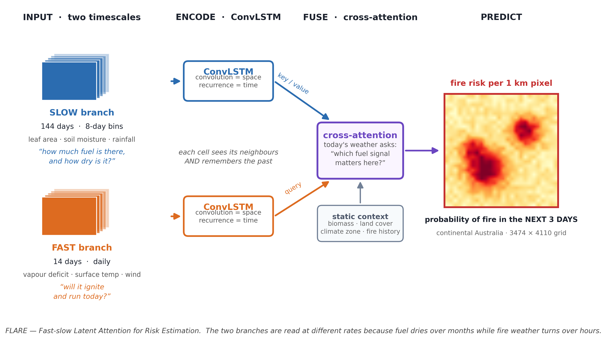
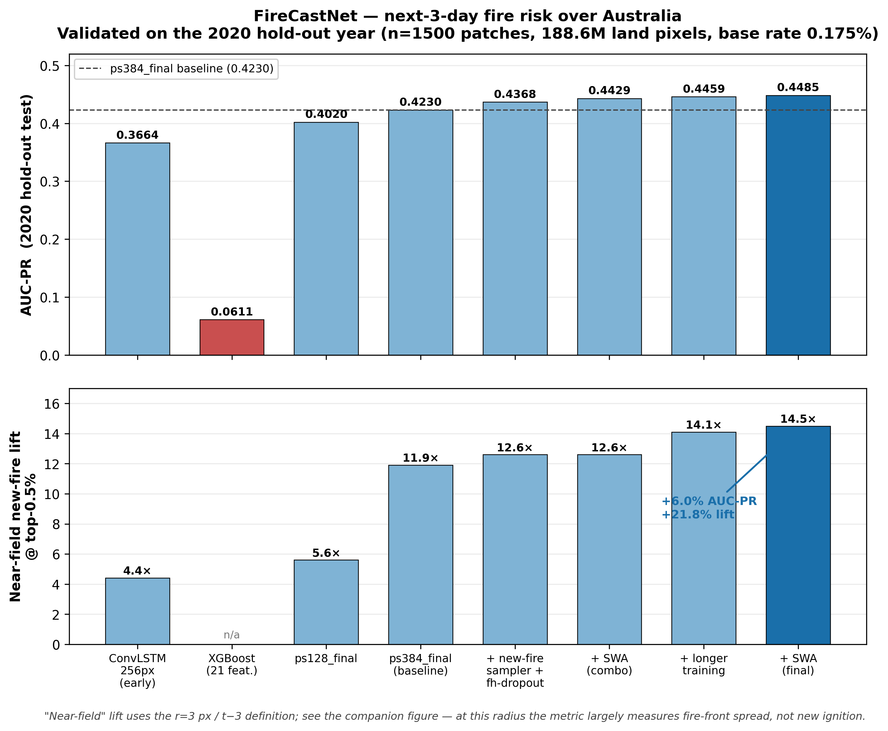

# FLARE

**F**ast-slow **L**atent **A**ttention for **R**isk **E**stimation — per-pixel
**next-3-day wildfire risk** for continental Australia at ~1 km resolution.

FLARE reads two input streams at different speeds, because the two things that
cause a fire evolve at different speeds: **fuel** dries out over months, while
**fire weather** turns over in hours. A ConvLSTM encodes each stream, and
cross-attention lets today's weather ask which part of the fuel signal matters.



## Predictions vs reality

Four dates from the 2020 hold-out year — left, what actually burned; right,
what FLARE predicted three days earlier. The black outline is the model's
top-1 % highest-risk area.


Performance varies with the situation: tightly clustered fire fronts are caught
almost completely (99 %, 88 %), while days with many small scattered ignitions
are much harder (39 %). Both cases are shown deliberately rather than only the
favourable ones.

---

## Results

All numbers are on the **2020 hold-out test year**, never used for training or
model selection (2015-2018 train, 2019 validation). Pooled over 1500 patches /
188.6 M land pixels, base fire rate **0.175 %**.

Primary metrics are threshold-free. Distance-stratified skill is reported
separately below, as a curve rather than a single number - see *Why we do not
headline a "new-fire lift" figure*.

| Model | AUC-PR | ROC-AUC |
|---|---|---|
| XGBoost (21 engineered features) | 0.0611 | - |
| ConvLSTM 256 px (early) | 0.3664 | 0.8604 |
| ConvLSTM 128 px | 0.4020 | 0.8814 |
| ConvLSTM 384 px (baseline) | 0.4230 | 0.9026 |
| + new-fire sampling + fire-history dropout | 0.4368 | 0.8955 |
| + weight averaging (SWA) | 0.4429 | 0.9011 |
| + extended training | 0.4459 | 0.8959 |
| **FLARE (final: SWA)** | **0.4485** | 0.8983 |

FLARE improves on the baseline by **+6.0 % AUC-PR** and outperforms a strong
XGBoost baseline by roughly **7x**.



### Operating characteristics (final model)

| Top-k | TPR (all fire) | Lift (all fire) | TPR (new fire) | Lift (new fire) |
|---|---|---|---|---|
| 0.01 % | 0.101 | 1006x | 0.000 | 0.7x |
| 0.1 % | 0.352 | 353x | 0.008 | 7.9x |
| 0.5 % | 0.515 | 103x | 0.073 | **14.5x** |
| 1 % | 0.567 | 57x | 0.127 | 12.7x |
| 5 % | 0.660 | 13x | 0.292 | 5.8x |

All-fire enrichment peaks at the tightest threshold; new-fire enrichment peaks
mid-range at top-0.5 %.

---

## Why we do not headline a "new-fire lift" figure

Much of the wildfire-ML literature reports a "new-fire" enrichment computed by
excluding fire pixels within *r* pixels of recent fire. We measured how much
that number depends on *r*, and the answer is: almost entirely. We therefore
report the full curve and a stratified breakdown instead of a single figure.

### Skill by distance stratum (final model, 2020 hold-out, 600 patches)

| Stratum | Distance from recent fire | Share of fire px | Lift @0.5 % |
|---|---|---|---|
| Persistence + adjacent spread | 0-1 px | 48 % | 53.0x - 33.0x |
| Near-field spread | 1-5 px | 19 % | 33.0x - 3.4x |
| Mid-field | 5-10 px | 9 % | 3.4x - 0.1x |
| **Isolated ignition** | **>= 10 px** | **21 %** | **0.1x** |

Shares are of all fire pixels under a 3-day history window and do not sum to
100 % because the strata are nested cumulative thresholds. Lift ranges give the
value at each stratum boundary.

Moving the cutoff from 3 px to 5 px - both equally defensible - changes the
headline number **threefold**. Our implementation also used
`binary_dilation(iterations=3)`, whose default cross structuring element is a
taxicab diamond rather than a 3 px euclidean disk, so the shipped metric was not
even the radius it claimed. And the same model, patches and radius yield 2.51x
or 0.11x depending on whether "recent fire" is a single t-3 slice or a
multi-day union.

No principled single *r* exists: spread rates range from ~1 km/h in forest to
~25 km/h in grassland, so no fixed distance separates spread from ignition
across Australia. That irreducible ambiguity is the argument for publishing the
curve.


At the commonly used **r = 3 px (3 km)** threshold, **89 % of pixels labelled
"new fire" lie within 20 km of, or are re-detections of, fire from the previous
30 days.** Skill decays sharply with distance and falls **below random**
(lift ~0.1x) beyond ~10 km:

| Distance threshold | 0 px | 1 px | 3 px | 5 px | 10 px | 20 px |
|---|---|---|---|---|---|---|
| New-fire lift @0.5 % | 53.0x | 33.0x | 11.1x | 3.4x | **0.1x** | **0.1x** |

**Interpretation.** The headline 14.5x is genuine *near-field spread* skill, and
model-vs-model comparisons at fixed *r* remain valid. But the main model has
**essentially no skill at genuinely isolated new ignitions** (0.11x at 10 km).

### A fire-history-free specialist recovers part of the far field

We trained a second model with the fire-history inputs removed entirely,
forcing prediction from weather, terrain and lightning alone. On the pooled
validation metric it looks like a total failure (val AP 0.012 vs 0.51, a ~50x
collapse). Scored in the regime it was designed for, it is the **only model
here that beats random on isolated ignitions**:

| Model | r=10 px | r=20 px | r=40 px |
|---|---|---|---|
| Main model (SWA) | 0.11x | 0.12x | 0.20x |
| **No-fire-history specialist** | **0.60x** | **0.43x** | **1.55x** |
| Probability average of both | 0.07x | 0.06x | 0.23x |

Three points follow:

1. **Weather/terrain/lightning do carry far-field ignition signal** - roughly
   5x more than the main model at 10 km - but it is far too weak to register in
   a pooled metric dominated by near-field spread.
2. **Naive probability averaging destroys it** (0.07x, worse than either
   member). The main model's confident near-field predictions swamp the
   specialist. These two are strong in *disjoint* regimes, so a blend is the
   wrong operator; a **regime-switched** rule is required - specialist where no
   recent fire lies within ~10 km, main model elsewhere.
3. **Pooled validation metrics can be actively misleading.** A model 50x worse
   on val AP was the only one to clear 1.0x where it matters.

The r=40 px figures rest on 2-11 qualifying pixels per patch and are
correspondingly noisy; treat the direction as robust and the magnitude as
uncertain. The r=10 px comparison (46 px/patch) is solid.

We recommend reporting **two numbers**: near-field spread lift (r = 3 px) and
true new-ignition lift (r >= 10 px). **State which "recent fire" definition
produced them** - far-field lift is highly sensitive to whether the reference
mask is a single t-3 slice or a union over a multi-day window (we measured
2.51x vs 0.11x for the same model, patches and radius under the two
conventions). Figures here use the multi-day-union definition.

### Combining the two models does not work

We also tested a regime-switched combiner: assign each pixel to a regime by
distance-to-recent-fire, score it with the model that owns that regime, using
within-regime percentile ranks so the two output distributions stay
commensurable, and sweep how much of the top-k budget the far field may claim
(3 switch radii x 6 budget weights). **No favourable trade exists.** Small
budgets leave the far field unchanged; large ones lift it slightly while
collapsing AUC-PR by an order of magnitude (0.456 -> 0.033 -> 0.002). Nothing
beat the main model's own far-field score.

Top-k is a fixed budget, and the specialist's far-field ranking is not good
enough to justify spending any of it. The specialist's advantage over the main
model is real but too weak to exploit by score combination - closing this gap
needs a better far-field model, not a better mixing rule. Likely routes:
fire-weather indices (FFDI/FWI), live fuel moisture from Sentinel-2 SWIR, and
sub-pixel fuel continuity - none of which are in the current predictor set.

---

## Architecture

FLARE's backbone (`ConvLSTMSegDual`) is two independent ConvLSTM encoders fused by per-pixel
cross-attention (query = fast branch, key/value = slow branch):

- **Slow branch** - LAI, soil moisture, precipitation over **144 days** in
  8-day bins (18 steps). Captures fuel accumulation and drought.
- **Fast branch** - VPD, land-surface temperature, wind over **14 days**
  daily. Captures ignition-favourable weather.
- **Static/auxiliary** - above-ground biomass, land mask, land cover and
  Koppen-Geiger embeddings, elevation-derived slope and aspect, lightning
  climatology, fuel age, downwind-of-fire alignment.
- 1.16 M parameters, 384 x 384 px training patches.

Predictor lag structure was selected empirically: LAI peaks at ~130 days
(AUC 0.779), soil moisture and precipitation at ~150 days.

---

## Repository layout

```
firecastnet/
  models/        ConvLSTM backbone + Lightning modules
  data/          datamodule, cube builders, channel statistics
  training/      training entry point + SLURM script
  evaluation/    test-set metrics, ensembling, calibration, diagnostics
checkpoints/     final model weights (SWA, 4.2 MB)
figures/         evaluation figures
docs/            full development log
```

## Quick start

```bash
pip install -r requirements.txt

# Evaluate FLARE on the 2020 test year
CKPT=checkpoints/firecastnet_best_swa.ckpt PATCH=384 EVAL_YEAR=2020 N_PATCH=1500 \
  python firecastnet/evaluation/operational_stats_dual.py

# Reproduce the new-fire definition analysis
CKPT=checkpoints/firecastnet_best_swa.ckpt PATCH=384 N_PATCH=600 \
  python firecastnet/evaluation/newfire_definition_sweep.py
```

Data cubes are published separately on Zenodo (see *Data*).

---

## Methodological notes

Findings that generalise beyond this dataset, documented in
`docs/DEVELOPMENT_LOG.md`:

1. **Validation AP does not reliably predict test AP.** Multiple configurations
   won on 2019 validation and lost on 2020 test - most sharply, an OHEM variant
   produced the best validation AP ever recorded (0.5242) and the *worst* test
   AUC-PR (0.4314). Every candidate was confirmed on the hold-out year before
   acceptance.
2. **Weight averaging (SWA) is a reliable free gain.** Averaging 3 near-equal
   late checkpoints improved test AUC-PR on all three runs it was applied to.
   No retraining, no inference cost.
3. **Ensemble only comparable-strength members.** Probability averaging beat the
   best single member when all members were of similar quality, and lost twice
   when one weak member was included.
4. **A global isotonic calibration cannot change AUC-PR** (it is monotone), but
   it *does* create ties, which costs ~0.7 % AP. Per-group calibration can
   change ranking, but did not improve AP here.
5. **The model relies overwhelmingly on fire proximity.** Permutation importance
   attributes ~78 % of decisions to distance-to-recent-fire and fire history.
6. **Judge a specialist model in its own regime, not on the pooled metric.**
   The fire-history-free model is ~50x worse on pooled validation AP and
   simultaneously the only model that beats random on isolated ignitions.
7. **A real but weak signal may still be unexploitable.** The specialist beats
   the main model ~5x in the far field, yet no regime-switched combination
   converted that into a net gain, because top-k is a fixed budget.

---

## Data

Data cubes are archived on Zenodo: **[DOI to be inserted]**

Daily cubes are `zarr` stores on the SMIPS ~1 km grid (3474 x 4110, EPSG:4326,
0.01 deg pixels, origin 112.905 E / -9.005 S) with 7 dynamic channels
`[soil moisture, wind, VPD, precipitation, LST, NDVI, LAI]`, static layers, and
`y_fire_3d` targets derived from VIIRS active-fire detections.

Full 2015-2020 daily cubes total ~300 GB and exceed Zenodo record limits; the
archive contains the **2020 test year** plus the pre-binned slow cube and
auxiliary rasters, sufficient to reproduce all reported evaluation results.
Remaining years can be rebuilt with `firecastnet/data/build_*.py` from the
public BARRA2, MODIS, VIIRS and SMIPS sources.

**Known data caveat:** `y_fire_3d` labels ocean pixels as fire = 1. Always apply
the land mask before any distance transform or metric computation.

## Citation

```bibtex
@software{flare_australia,
  title  = {FLARE: Fast-slow Latent Attention for Risk Estimation --
            next-3-day wildfire risk forecasting over Australia},
  year   = {2026},
  url    = {https://github.com/catKorb/flare-wildfire-australia}
}
```

## License

MIT (code). Data products follow the licences of their upstream sources
(BARRA2, MODIS, VIIRS, SMIPS, ETOPO1, LIS/OTD).
