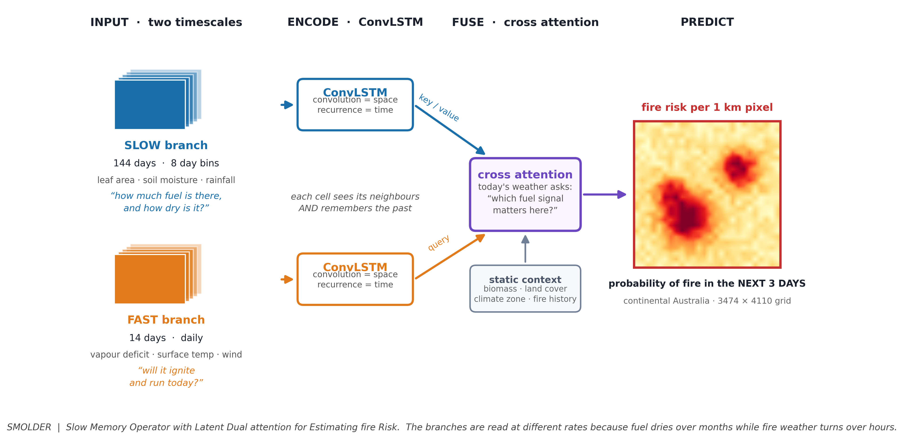
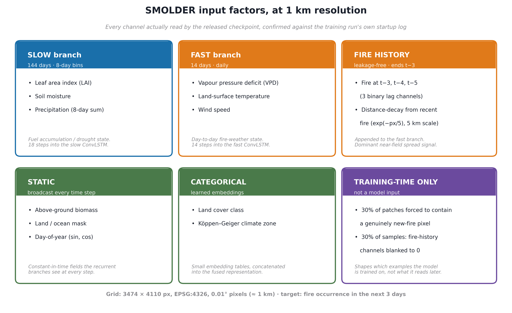
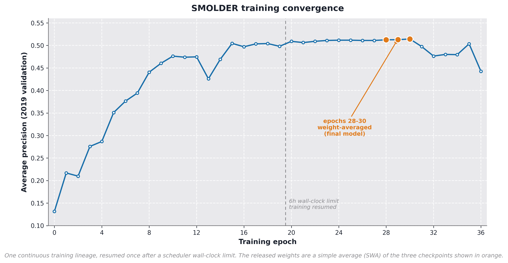
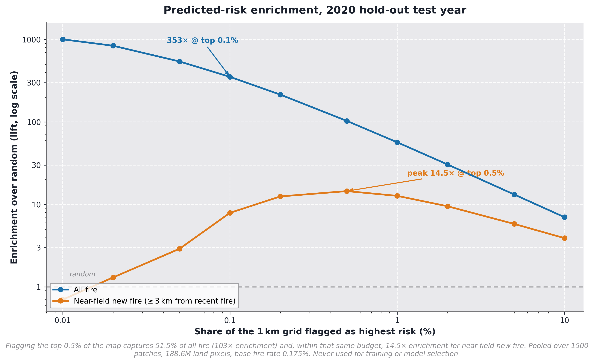
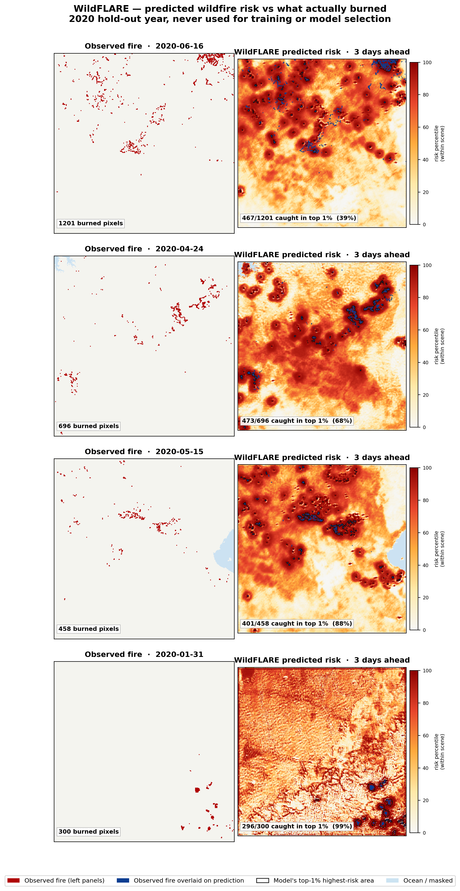
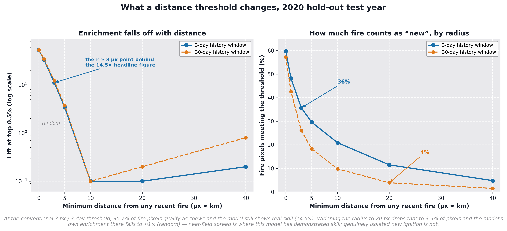

# SMOLDER

**S**low-**M**emory **O**perator with **L**atent **D**ual-attention for
**E**stimating fire **R**isk — per-pixel **next-3-day wildfire risk** for
continental Australia at ~1 km resolution.

The name is literal: a smoulder is a slow burn, and *slow memory* is what
separates this model from short-window fire-weather baselines. SMOLDER tracks
fuel state over **144 days**, because the two things that cause a fire evolve
at very different speeds — **fuel** dries out over months, while **fire
weather** turns over in hours. A ConvLSTM encodes each stream at its own
rate, and cross-attention lets today's weather ask which part of the
long-term fuel signal matters where.



## Inputs, at 1 km resolution

Every channel the released checkpoint actually reads, confirmed against the
training run's own startup log — no more, no less.



## Training convergence

One continuous run (resumed once after a scheduler wall-clock limit). The
released weights are a weight average (SWA) of three late, near-equal
checkpoints — the single most reliable free improvement found in developing
this model, applied here as the final step.



---

## Results

The numbers below are on the **2020 hold-out test year**, never used for
training or model selection (2015–2018 train, 2019 validation). Pooled over
1500 patches / 188.6 M land pixels, base fire rate **0.175 %**.

| Metric | Value |
|---|---|
| AUC-PR | **0.4485** |
| ROC-AUC | 0.8983 |
| Fire captured, flagging top 0.5 % of the map | 51.5 % (103× enrichment) |
| New-fire lift, same budget | 14.5× |



### Operating characteristics

| Top-k | TPR (all fire) | Lift (all fire) | TPR (new fire) | Lift (new fire) |
|---|---|---|---|---|
| 0.01 % | 0.101 | 1006× | 0.000 | 0.7× |
| 0.1 % | 0.352 | 353× | 0.008 | 7.9× |
| 0.5 % | 0.515 | 103× | 0.073 | **14.5×** |
| 1 % | 0.567 | 57× | 0.127 | 12.7× |
| 5 % | 0.660 | 13× | 0.292 | 5.8× |

All-fire enrichment peaks at the tightest threshold; new-fire enrichment
peaks mid-range at top 0.5 %.

## Predictions vs reality

Four dates from the 2020 hold-out year — left, what actually burned; right,
what SMOLDER predicted three days earlier. The black outline is the model's
top-1 % highest-risk area.



Performance varies with the situation: tightly clustered fire fronts are
caught almost completely (99 %, 88 %), while days with many small scattered
ignitions are much harder (39 %). Both cases are shown deliberately rather
than only the favourable ones.

---

## What "new-fire lift" does and does not mean

The wildfire-ML literature commonly reports a "new-fire" enrichment computed
by excluding fire pixels within *r* pixels of recent fire. We measured how
much that number depends on *r*, and the answer is: almost entirely — so we
report the full curve, not a single figure.



At the conventional **r = 3 px (≈ 3 km)** threshold, 35.7 % of fire pixels
qualify as "new" and the model shows real skill (14.5× lift). Widening the
radius to 20 px — the honest boundary between *nearby spread* and *genuinely
isolated ignition* — drops that share to 3.9 % of pixels, and the model's own
enrichment there falls to ≈1× (random). **The 14.5× headline is real
near-field spread skill; this model has essentially no demonstrated skill at
predicting an isolated ignition with no fire anywhere nearby.**

No principled single *r* exists — Australian fire spread rates range from
~1 km/h in closed forest to ~25 km/h in grassland, so no fixed distance
cleanly separates "spread" from "new ignition" everywhere. That ambiguity is
the reason to publish the curve rather than a point estimate.

---

## Architecture

`ConvLSTMSegDual` — two independent ConvLSTM encoders fused by per-pixel
cross-attention (query = fast branch, key/value = slow branch). 1.16 M
parameters, 384 × 384 px training patches. Predictor lag structure was
selected empirically beforehand: LAI's skill peaks at a ~130-day lag
(AUC 0.779), soil moisture and precipitation at ~150 days — which is why the
slow branch carries 144 days of history.

## Repository layout

```
smolder/
  models/        ConvLSTM backbone + Lightning modules
  data/          datamodule, cube builders, channel statistics
  training/      training entry point + SLURM script
  evaluation/    test-set metrics, calibration, diagnostics
checkpoints/     final model weights (SWA, 4.2 MB)
figures/         every figure in this README + the script that generates it
docs/            full development log
```

## Quick start

```bash
pip install -r requirements.txt

# Evaluate SMOLDER on the 2020 test year
CKPT=checkpoints/firecastnet_best_swa.ckpt PATCH=384 EVAL_YEAR=2020 N_PATCH=1500 \
  python smolder/evaluation/operational_stats_dual.py

# Reproduce the new-fire distance-decay analysis
CKPT=checkpoints/firecastnet_best_swa.ckpt PATCH=384 N_PATCH=600 \
  python smolder/evaluation/newfire_definition_sweep.py

# Regenerate every figure in this README
cd figures && python make_smolder_architecture.py && python make_inputs_figure.py \
  && python make_convergence_figure.py && python make_lift_figure.py \
  && python make_newfire_decay_figure.py
```

Data cubes are published separately on Zenodo (see *Data*).

---

## Data

Data cubes are archived on Zenodo: **[DOI to be inserted]**

Daily cubes are `zarr` stores on the SMIPS ~1 km grid (3474 × 4110,
EPSG:4326, 0.01° pixels, origin 112.905° E / −9.005° S), with `y_fire_3d`
targets derived from VIIRS active-fire detections.

Full 2015–2020 daily cubes total ~300 GB and exceed Zenodo record limits; the
archive contains the **2020 test year** plus the pre-binned slow cube,
sufficient to reproduce every result reported here. Remaining years can be
rebuilt with `smolder/data/build_*.py` from the public BARRA2, MODIS, VIIRS
and SMIPS sources.

**Known data caveat:** `y_fire_3d` labels ocean pixels as fire = 1. Always
apply the land mask before any distance transform or metric computation.

## Citation

```bibtex
@software{smolder_australia,
  title  = {SMOLDER: a Slow-Memory Operator with Latent Dual-attention for
            Estimating wildfire Risk over Australia},
  year   = {2026},
  url    = {https://github.com/catKorb/smolder-wildfire-australia}
}
```

## License

MIT (code). Data products follow the licences of their upstream sources
(BARRA2, MODIS, VIIRS, SMIPS).
