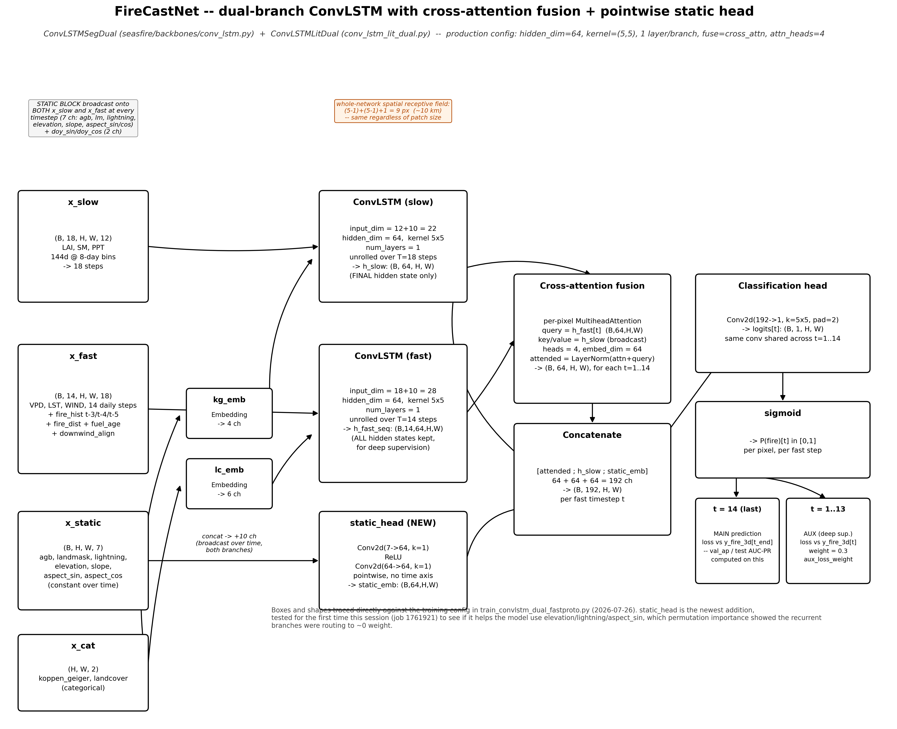

# FireCastNet — Australia

Per-pixel **next-3-day wildfire risk** forecasting for continental Australia at
~1 km resolution, using a dual-branch ConvLSTM that separates slow fuel-state
dynamics from fast fire-weather dynamics.



---

## Results

All numbers are on the **2020 hold-out test year**, never used for training or
model selection (2015-2018 train, 2019 validation). Pooled over 1500 patches /
188.6 M land pixels, base fire rate **0.175 %**.

| Model | AUC-PR | ROC-AUC | Near-field new-fire lift @0.5 % |
|---|---|---|---|
| XGBoost (21 engineered features) | 0.0611 | - | - |
| ConvLSTM 256 px (early) | 0.3664 | 0.8604 | 4.4x |
| ConvLSTM 128 px | 0.4020 | 0.8814 | 5.6x |
| ConvLSTM 384 px (baseline) | 0.4230 | 0.9026 | 11.9x |
| + new-fire sampling + fire-history dropout | 0.4368 | 0.8955 | 12.6x |
| + weight averaging (SWA) | 0.4429 | 0.9011 | 12.6x |
| + extended training | 0.4459 | 0.8959 | 14.1x |
| **+ SWA - final model** | **0.4485** | 0.8983 | **14.5x** |

The final model improves on the baseline by **+6.0 % AUC-PR** and **+21.8 %
new-fire lift**, and outperforms a strong XGBoost baseline by roughly **7x** on
AUC-PR.


### Operating characteristics (final model)

| Top-k | TPR (all fire) | Lift (all fire) | TPR (new fire) | Lift (new fire) |
|---|---|---|---|---|
| 0.01 % | 0.101 | 1006x | 0.000 | 0.7x |
| 0.1 % | 0.352 | 353x | 0.008 | 7.9x |
| 0.5 % | 0.515 | 103x | 0.073 | **14.5x** |
| 1 % | 0.567 | 57x | 0.127 | 12.7x |
| 5 % | 0.660 | 13x | 0.292 | 5.8x |

All-fire enrichment peaks at the tightest threshold; new-fire enrichment peaks
mid-range at top-0.5 %.

---

## Important caveat: what "new fire" actually measures

The conventional "new fire" definition - a fire pixel more than *r* pixels from
any recent fire - is highly sensitive to *r*, and this project quantified that
sensitivity directly.


At the commonly used **r = 3 px (3 km)** threshold, **89 % of pixels labelled
"new fire" lie within 20 km of, or are re-detections of, fire from the previous
30 days.** Skill decays sharply with distance and falls **below random**
(lift ~0.1x) beyond ~10 km:

| Distance threshold | 0 px | 1 px | 3 px | 5 px | 10 px | 20 px |
|---|---|---|---|---|---|---|
| New-fire lift @0.5 % | 53.0x | 33.0x | 11.1x | 3.4x | **0.1x** | **0.1x** |

**Interpretation.** The headline 14.5x is genuine *near-field spread* skill, and
model-vs-model comparisons at fixed *r* remain valid. But this model has
**essentially no skill at genuinely isolated new ignitions**. A dedicated model
trained without fire-history inputs failed to learn at all (val AP ~0.01 vs
0.51), indicating the remaining predictors (weather, terrain, lightning
climatology) do not contain sufficient signal for isolated ignition at this
resolution.

We recommend reporting **two numbers**: near-field spread lift (r = 3 px) and
true new-ignition lift (r >= 10 px).

---

## Architecture

`ConvLSTMSegDual` - two independent ConvLSTM encoders fused by per-pixel
cross-attention (query = fast branch, key/value = slow branch):

- **Slow branch** - LAI, soil moisture, precipitation over **144 days** in
  8-day bins (18 steps). Captures fuel accumulation and drought.
- **Fast branch** - VPD, land-surface temperature, wind over **14 days**
  daily. Captures ignition-favourable weather.
- **Static/auxiliary** - above-ground biomass, land mask, land cover and
  Koppen-Geiger embeddings, elevation-derived slope and aspect, lightning
  climatology, fuel age, downwind-of-fire alignment.
- 1.16 M parameters, 384 x 384 px training patches.

Predictor lag structure was selected empirically: LAI peaks at ~130 days
(AUC 0.779), soil moisture and precipitation at ~150 days.

---

## Repository layout

```
firecastnet/
  models/        ConvLSTM backbone + Lightning modules
  data/          datamodule, cube builders, channel statistics
  training/      training entry point + SLURM script
  evaluation/    test-set metrics, ensembling, calibration, diagnostics
checkpoints/     final model weights (SWA, 4.2 MB)
figures/         evaluation figures
docs/            full development log
```

## Quick start

```bash
pip install -r requirements.txt

# Evaluate the released model on the 2020 test year
CKPT=checkpoints/firecastnet_best_swa.ckpt PATCH=384 EVAL_YEAR=2020 N_PATCH=1500 \
  python firecastnet/evaluation/operational_stats_dual.py

# Reproduce the new-fire definition analysis
CKPT=checkpoints/firecastnet_best_swa.ckpt PATCH=384 N_PATCH=600 \
  python firecastnet/evaluation/newfire_definition_sweep.py
```

Data cubes are published separately on Zenodo (see *Data*).

---

## Methodological notes

Findings that generalise beyond this dataset, documented in
`docs/DEVELOPMENT_LOG.md`:

1. **Validation AP does not reliably predict test AP.** Multiple configurations
   won on 2019 validation and lost on 2020 test - most sharply, an OHEM variant
   produced the best validation AP ever recorded (0.5242) and the *worst* test
   AUC-PR (0.4314). Every candidate was confirmed on the hold-out year before
   acceptance.
2. **Weight averaging (SWA) is a reliable free gain.** Averaging 3 near-equal
   late checkpoints improved test AUC-PR on all three runs it was applied to.
   No retraining, no inference cost.
3. **Ensemble only comparable-strength members.** Probability averaging beat the
   best single member when all members were of similar quality, and lost twice
   when one weak member was included.
4. **A global isotonic calibration cannot change AUC-PR** (it is monotone), but
   it *does* create ties, which costs ~0.7 % AP. Per-group calibration can
   change ranking, but did not improve AP here.
5. **The model relies overwhelmingly on fire proximity.** Permutation importance
   attributes ~78 % of decisions to distance-to-recent-fire and fire history.

---

## Data

Data cubes are archived on Zenodo: **[DOI to be inserted]**

Daily cubes are `zarr` stores on the SMIPS ~1 km grid (3474 x 4110, EPSG:4326,
0.01 deg pixels, origin 112.905 E / -9.005 S) with 7 dynamic channels
`[soil moisture, wind, VPD, precipitation, LST, NDVI, LAI]`, static layers, and
`y_fire_3d` targets derived from VIIRS active-fire detections.

Full 2015-2020 daily cubes total ~300 GB and exceed Zenodo record limits; the
archive contains the **2020 test year** plus the pre-binned slow cube and
auxiliary rasters, sufficient to reproduce all reported evaluation results.
Remaining years can be rebuilt with `firecastnet/data/build_*.py` from the
public BARRA2, MODIS, VIIRS and SMIPS sources.

**Known data caveat:** `y_fire_3d` labels ocean pixels as fire = 1. Always apply
the land mask before any distance transform or metric computation.

## Citation

```bibtex
@software{firecastnet_australia,
  title  = {FireCastNet Australia: dual-branch ConvLSTM for next-3-day
            wildfire risk forecasting},
  year   = {2026},
  url    = {https://github.com/USERNAME/firecastnet-australia}
}
```

## License

MIT (code). Data products follow the licences of their upstream sources
(BARRA2, MODIS, VIIRS, SMIPS, ETOPO1, LIS/OTD).
